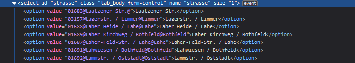
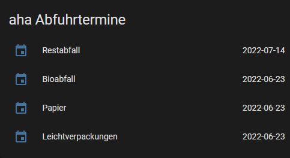

# aha region
Home Assistant custom component for aha (Zweckverband Abfallwirtschaft Region Hannover)

[](https://github.com/flabbamann/aha_region/actions/workflows/ci.yaml)

## Installation
Copy `custom_components/aha_region` to `custom_components` dir and restart Home Assistant

## Configuration
Go to https://www.aha-region.de/abholtermine/abfuhrkalender and search for your address. Rightclick the dropdown to select the street and click `inspect`. Expand the select in the sources, find and copy the value for your street.



Configure the component via `configuration.yaml`.

```yaml
sensor:
  # aha region waste sensors
  - platform: aha_region
    gemeinde: "Hannover"
    strasse: "00152@Am Küchengarten / Linden-Mitte@Linden-Mitte" # value from dropdown
    hausnr: 11
    hausnraddon: "a" # optional
```
Strasse and gemeinde need to be _exactly_ like on the aha website.

## Example
You should now have a sensor with the next collection date for each waste type.



## Notes

Works great with westenberg's [Garbage Reminder](https://community.home-assistant.io/t/garbage-reminder/284213) blueprint 👍
