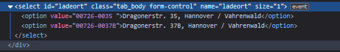

# aha region
[](https://github.com/flabbamann/aha_region/actions/workflows/ci.yaml)
[](https://my.home-assistant.io/redirect/hacs_repository/?owner=flabbamann&repository=aha_region&category=integration)

Home Assistant custom component for aha (Zweckverband Abfallwirtschaft Region Hannover). This integration provides the next collection date per waste type for a given address as date-sensors.

## Installation

### [HACS](https://hacs.xyz/) (recommended to get update notifications)

If you setup [My Home Assistant](https://my.home-assistant.io/) just click the `HACS Custom` badge above.

If not follow these steps:

1. `HACS` > `Integrations` > `⋮` > `Custom Repositories`
2. `Repository`: paste the url of this repo
3. `Category`: Integration
4. Click `Add`
5. Close `Custom Repositories` dialog
6. Click `+ EXPLORE & DOWNLOAD REPOSITORIES`
7. Search for `aha region`
8. Click `Download`
9. Restart _Home Assistant_


### Manual
Copy `custom_components/aha_region` to `custom_components` dir and restart Home Assistant

## Configuration
Go to https://www.aha-region.de/abholtermine/abfuhrkalender and search for your address. Rightclick the dropdown to select the street and click `inspect`. Expand the select in the sources, find and copy the `value` for your street.


Configure the component via `configuration.yaml`.

```yaml
sensor:
  # aha region waste sensors
  - platform: aha_region
    gemeinde: "Hannover"
    strasse: "00152@Am Küchengarten / Linden-Mitte@Linden-Mitte" # value from dropdown
    hausnr: 11
    hausnraddon: "a" # optional, remove if not needed for your address!
```
Strasse and gemeinde need to be _exactly_ like on the aha website.


Some places need to specify an `Abholplatz`, to get this search for your address and another dropdown to select the `Abholplatz` appears. Find your value in the sources like for your street:



This also needs to be _exactly_ like on the website. Note the space at the end of the value!

```yaml
sensor:
  # aha region waste sensors
  - platform: aha_region
    gemeinde: "Hannover"
    strasse: "00726@Dragonerstr. / Vahrenwald@Vahrenwald" # value from dropdown
    hausnr: 35
    abholplatz: "00726-0035 " # optional, remove if not needed for your address!
```


## Example
You should now have a sensor with the next collection date for each waste type collected at the given address. Not all addresses have all four waste types.


The sensors update twice a day and the date will only change _after_ the scheduled collection date. So if the waste collection is scheduled for today, the sensors will show today as next collection date and change tomorrow for the next cycle.

## Notes

Works great with westenberg's [Garbage Reminder](https://community.home-assistant.io/t/garbage-reminder/284213) blueprint 👍
