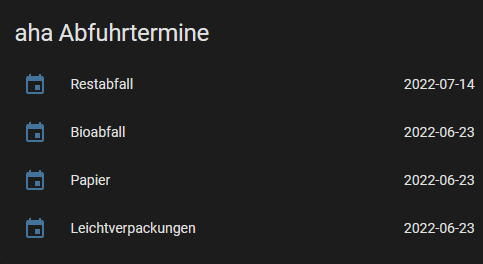

# aha region

Home Assistant custom component for aha (Zweckverband Abfallwirtschaft Region Hannover). This integration provides the next collection date per waste type for a given address as date-sensors.

_DISCLAIMER: This is a personal open source project and doesn't have any connection with aha. The name aha and the logo are property of Zweckverband Abfallwirtschaft Region Hannover._

## Installation

### [HACS](https://hacs.xyz/) (recommended to get update notifications)

If you setup [My Home Assistant](https://my.home-assistant.io/) just click the `HACS Custom` badge above.

If not follow these steps:

1. `HACS` > `Integrations` > `⋮` > `Custom Repositories`
2. `Repository`: paste the url of this repo
3. `Category`: Integration
4. Click `Add`
5. Close `Custom Repositories` dialog
6. Click `+ EXPLORE & DOWNLOAD REPOSITORIES`
7. Search for `aha region`
8. Click `Download`
9. Restart _Home Assistant_

### Manual
Copy `custom_components/aha_region` to `custom_components` dir and restart Home Assistant

## Configuration
The integration can be configured via the Home Assistant UI.

1. Go to `Settings` > `Devices & services`.
2. Click `Add integration` and search for `aha region`.
3. Select your `Gemeinde`.
4. Select the first letter of your street.
5. Select your street from the scraped website values.
6. Enter the house number and an optional house number suffix.
7. If aha requires an `Abholplatz` for the address, the flow will show the scraped options automatically.

## Example
You should now have a sensor with the next collection date for each waste type collected at the given address. Not all addresses have all four waste types.

The sensors update every three hours and the date will only change _after_ the scheduled collection date. So if the waste collection is scheduled for today, the sensors will show today as next collection date and change tomorrow for the next cycle.

## Notes

Works great with westenberg's [Garbage Reminder](https://community.home-assistant.io/t/garbage-reminder/284213) blueprint 👍
